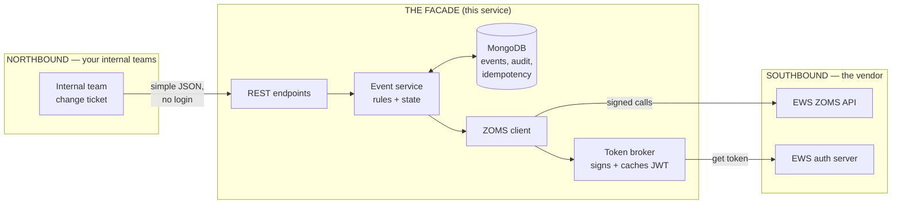
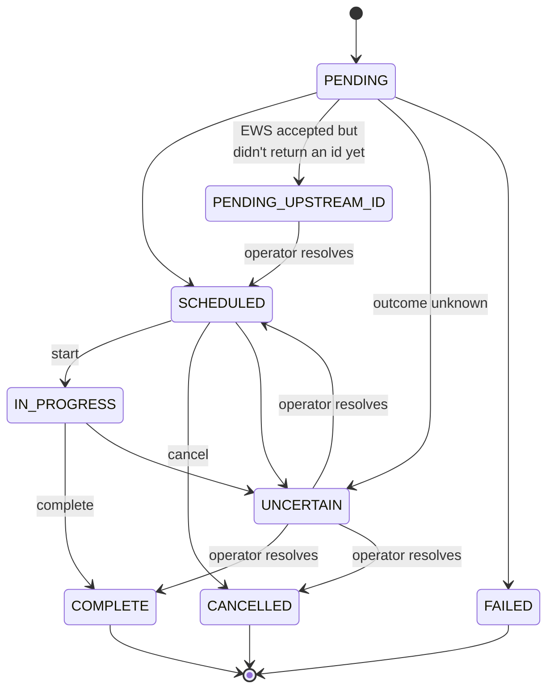

# How It All Works — the Zelle Maintenance Facade in plain English

This is the friendly, no-jargon guide to what this service does, how the
pieces fit together, how to call it, and what to tell your internal and
external teams. If you want the exact vendor field lengths read
[zoms-api-reference.md](zoms-api-reference.md); for the design rationale read
[architecture.md](architecture.md). This doc is the map that sits on top of
both.

---

## 1. The one-paragraph version

Early Warning Services (EWS) runs the real Zelle® system. When your bank
needs to do maintenance on its Zelle setup, EWS can **hold** live payment
messages during a maintenance window so nothing breaks mid-change. EWS
exposes that control through a service called **ZOMS** (Zelle Organization
Maintenance Service). ZOMS is fiddly to call: it needs a signed JWT, an
OAuth2 token exchange, exact field formats, and careful retry handling.

**This facade hides all of that.** Internal teams call a handful of simple
REST endpoints on *our* service. Our service does the hard, dangerous part
of talking to EWS on their behalf. Think of it as a **translator and a
safety gate** sitting between your teams and EWS.

---

## 2. The big picture: two sides that never mix

The whole design rests on one idea: there are **two completely separate
sides**, and they never share vocabulary.



- **Northbound** = your internal teams → this facade. Simple JSON. **No
  login.** Because it only lives on the internal network. Callers just
  identify themselves with a header.
- **Southbound** = this facade → EWS. All the security lives here: the
  signed JWT, the token exchange, the exact vendor field formats.

**The golden rule:** a northbound caller never sees a token, never sees a
JWT, never sees an EWS error message, and never sees an EWS field name. If
EWS breaks, the caller gets a clean, generic error from *us* — not a leak of
vendor internals. Everything crosses the border in exactly one place in the
code (`EventService._build_ews_payload`), and nowhere else.

---

## 3. Where this actually runs

Heads-up so nobody looks for a `main.py` that isn't here: **this repo is not
a standalone app.** It is the `zelle` "bounded context" that gets **mounted
into a bigger host FastAPI application** (`fdn-c-amp-fapis-py`) alongside
sibling modules. The host app calls our `register_zelle(...)` function during
startup and hands us two things it already owns:

1. A shared HTTP client (used for all EWS calls), and
2. A MongoDB database (where we store event state, the audit trail, and
   idempotency records).

So "deploying this" means the host app imports it and calls `register_zelle`.
The only thing in this repo you can run on its own is a **fake EWS stub**
(`src/fake_ews/app.py`) used for local testing — it pretends to be EWS so you
can exercise the whole flow without touching the real vendor.

---

## 4. Northbound — how your internal teams call it

All paths below are relative to wherever the host app mounts us. Every
endpoint speaks JSON.

### The endpoints

| What you want to do | Call this |
|---|---|
| Schedule a maintenance window | `POST /v1/maintenance-events` |
| Start a scheduled window (holds begin) | `POST /v1/maintenance-events/{eventId}/start` |
| Complete a running window (holds release) | `POST /v1/maintenance-events/{eventId}/complete` |
| Cancel a window that hasn't started | `POST /v1/maintenance-events/{eventId}/cancel` |
| List events (optionally by status) | `GET /v1/maintenance-events` |
| Look up one event | `GET /v1/maintenance-events/{eventId}` |
| Operator: manually resolve a stuck event | `POST /v1/admin/maintenance-events/{eventId}/resolve` |

### The headers that matter

| Header | When | Meaning |
|---|---|---|
| `X-Client-Id` | **Every call** | Who you are. This is how we attribute and authorize you (see the allowlist in §7). Not a password — an identity. |
| `Idempotency-Key` | Optional, on schedule | Send the same key to safely retry a schedule without creating duplicates. Same key + same body = you get the original result back, not a second event. |
| `X-Confirm-Ticket` | **Required** on start/complete/cancel | A safety catch. Its value must exactly equal the event's own ticket number, or we reject the call. Stops "oops, wrong event" mistakes on high-impact actions. |
| `X-Correlation-Id` | Optional, any call | A tracing id. If you send one we echo it back and stamp it through the logs/audit. If you don't, we mint one. **Every response carries it back** in the `X-Correlation-Id` response header — grab it for support tickets. |

There is also a `?dry_run=true` query flag on start/complete/cancel: it runs
all the checks and writes an audit record **but does not call EWS and does
not change state.** Great for "would this be allowed right now?" without
pulling the trigger.

### Scheduling — the request body

You only send what a change ticket actually knows. All the org identity and
contact details are filled in from config on our side — callers never touch
them.

```jsonc
// POST /v1/maintenance-events
// Headers: X-Client-Id: payments-ops   Idempotency-Key: chg-48213
{
  "startTime": "2026-08-01T06:00:00Z",   // required, must be timezone-aware, not in the past
  "endTime":   "2026-08-01T08:00:00Z",   // required, must be after startTime
  "ticketNumber": "CHG-48213",           // required, 1–36 chars — your change ticket
  "reason": "Quarterly DB failover drill", // required, 1–255 chars
  "holdMode": "SELF_HOLD",               // optional: SELF_HOLD or EWS_HOLD (defaults from config)
  "allowOverlap": false,                 // optional: allow a window that overlaps another
  "suppressDuplicatePayments": true,     // optional
  "networkNotificationId": "NN-99123"    // optional, 1–36 chars
}
```

### What you get back — the same shape everywhere

Every event-returning endpoint gives you this:

```jsonc
{
  "eventId": "9f2c…",             // OUR id — use this in every follow-up call
  "status": "SCHEDULED",
  "startTime": "2026-08-01T06:00:00Z",
  "endTime": "2026-08-01T08:00:00Z",
  "ticketNumber": "CHG-48213",
  "reason": "Quarterly DB failover drill",
  "holdMode": "SELF_HOLD",
  "correlationId": "c-3b1e…",
  "createdAt": "2026-07-18T14:03:00Z",
  "lastConfirmedUpstreamAt": "2026-07-18T14:03:01Z"  // last time EWS confirmed intent; may be null
}
```

### The lifecycle — the states an event moves through



Plain-English status meanings for consumers:

| Status | What it means for you |
|---|---|
| `PENDING` | We're mid-way through the very first call. Transient. |
| `PENDING_UPSTREAM_ID` | EWS accepted it but we don't have their id yet. An operator will reconcile. You'll see a **202** on schedule. |
| `SCHEDULED` | Booked. You can `start` or `cancel` it. |
| `IN_PROGRESS` | Started — holds are active. You can `complete` it. |
| `COMPLETE` | Finished cleanly. Terminal. |
| `CANCELLED` | Called off before starting. Terminal. |
| `UNCERTAIN` | We're not sure the last action landed at EWS. **All actions are blocked** until a human operator resolves it. This is a safety stop, not a bug. |
| `FAILED` | The schedule never took. Terminal. |

### Important: reads show *our* record, not EWS's live truth

`GET` returns what our database last knew — "last known intent." It is **not**
a live query to EWS. That's deliberate (it keeps reads fast and cheap), but
tell consumers so nobody treats a `GET` as gospel about EWS's current state.

### Copy-paste: curl for every call

Set a base URL once (`$BASE` is wherever the host app mounts the facade), then
each call is a one-liner. These are bash-style; on PowerShell either call
`curl.exe` or swap the `\` line-continuations for backticks.

```bash
BASE=https://internal.host.example/api    # wherever the host app mounts us

# 1) Schedule a window — note the Idempotency-Key so a retry is safe
curl -sS -X POST "$BASE/v1/maintenance-events" \
  -H "X-Client-Id: payments-ops" \
  -H "Idempotency-Key: chg-48213" \
  -H "Content-Type: application/json" \
  -d '{
        "startTime": "2026-08-01T06:00:00Z",
        "endTime":   "2026-08-01T08:00:00Z",
        "ticketNumber": "CHG-48213",
        "reason": "Quarterly DB failover drill",
        "holdMode": "SELF_HOLD"
      }'
# -> 201 with an eventId. Use that eventId (call it $EID) below.

# 2) Start it — X-Confirm-Ticket MUST equal the event's ticketNumber
curl -sS -X POST "$BASE/v1/maintenance-events/$EID/start" \
  -H "X-Client-Id: payments-ops" \
  -H "X-Confirm-Ticket: CHG-48213"

# Dry-run first if you just want to check it would be allowed (no EWS call, no state change)
curl -sS -X POST "$BASE/v1/maintenance-events/$EID/start?dry_run=true" \
  -H "X-Client-Id: payments-ops" \
  -H "X-Confirm-Ticket: CHG-48213"

# 3) Complete it (holds release)
curl -sS -X POST "$BASE/v1/maintenance-events/$EID/complete" \
  -H "X-Client-Id: payments-ops" \
  -H "X-Confirm-Ticket: CHG-48213"

# 4) Cancel a window that hasn't started yet
curl -sS -X POST "$BASE/v1/maintenance-events/$EID/cancel" \
  -H "X-Client-Id: payments-ops" \
  -H "X-Confirm-Ticket: CHG-48213"

# 5) List events (optionally filter by status)
curl -sS "$BASE/v1/maintenance-events" -H "X-Client-Id: payments-ops"
curl -sS "$BASE/v1/maintenance-events?status=SCHEDULED" -H "X-Client-Id: payments-ops"

# 6) Read one event
curl -sS "$BASE/v1/maintenance-events/$EID" -H "X-Client-Id: payments-ops"

# 7) Operator only — resolve a stuck (UNCERTAIN / PENDING_UPSTREAM_ID) event after
#    reconciling with EWS by hand. ewsEventId is required only for PENDING_UPSTREAM_ID.
curl -sS -X POST "$BASE/v1/admin/maintenance-events/$EID/resolve" \
  -H "X-Client-Id: zelle-ops" \
  -H "Content-Type: application/json" \
  -d '{
        "actualStatus": "SCHEDULED",
        "attestation": "EWS NOC ref 4471 — confirmed booked",
        "ewsEventId": "e7b1c2d3-0000-4a5b-8c9d-1234567890ab"
      }'
```

---

## 5. Southbound — how the facade talks to EWS

Your teams never see any of this. It's here so you understand the machine.

### The token dance (done for you, once, and cached)

Before calling ZOMS, we need an access token from EWS. Getting one is a
two-step, standards-based flow:

1. **Build and sign a JWT** ("client assertion") with our RS256 private key.
   It says "I am this client, here's proof, valid for the next two minutes."
   The key is identified by a `kid` that EWS has on file.
2. **Exchange it for an access token** — we `POST` the assertion to EWS's
   auth server (`grant_type=client_credentials`) and get back a short-lived
   bearer token (typically ~30 min).

We then **cache that token** and reuse it for every ZOMS call until it's
close to expiring, at which point we quietly refresh. Only **one** refresh
happens at a time even under heavy concurrency (a single-flight lock), so we
never stampede the auth server. If EWS auth keeps failing, a **circuit
breaker** trips and we fail fast instead of hammering them.

### The actual EWS calls

Once we hold a token, the ZOMS client calls these (base URL comes from
config):

| Facade action | EWS call |
|---|---|
| schedule | `POST {api_base_url}/v1/events/schedule` |
| start | `POST {api_base_url}/v1/events/start` |
| complete | `POST {api_base_url}/v1/events/complete` |
| cancel | `POST {api_base_url}/v1/events/cancel` |

Each carries `Authorization: Bearer <token>`, a fresh `request-id` per
attempt, and (on schedule only) an `idempotency-id` so a retry can't
double-book.

### The dangerous part: retries

Because start/complete/cancel control **live payment holds**, we are
paranoid about retrying:

- If a call **never left** (connection refused) → safe to retry / mark
  unavailable.
- If a call **left but we never heard back** (read timeout) → we do **not**
  retry. We mark the event `UNCERTAIN` and make a human decide. Silently
  retrying could double-apply a hold on real money movement.

That asymmetry is the whole reason `UNCERTAIN` exists.

---

## 6. The middle bit — why this is more than a proxy

Between the two sides, the facade does the grown-up work:

- **Idempotency ledger.** We record your `Idempotency-Key` *before* any
  network call. Retry with the same key and body → you get the first answer
  back. Same key, *different* body → `409 Conflict` (you're reusing a key by
  mistake).
- **State machine.** An event can only move along legal transitions
  (§4 diagram), enforced atomically in the database. You can't `complete`
  something that never `start`ed.
- **Guardrails.** Allowlists (§7), overlapping-window detection, the
  `X-Confirm-Ticket` check, and the `UNCERTAIN` freeze.
- **Append-only audit trail.** Before every EWS call we write an `INTENT`
  record; after, an `OUTCOME` record. Nothing is ever updated or deleted.
  This is your forensic record of who did what, when, and how EWS responded
  (with secrets and PII masked).
- **Watchdog** (optional). A background task that notices events stuck too
  long and raises a loud `CRITICAL` log — and, when email alerting is
  configured, sends an email alert too — so an operator can step in.

---

## 7. What operators configure

All configuration is environment variables prefixed `ZELLE_` (the host app
can also pass them in directly). The important ones:

| Setting | What it is |
|---|---|
| `ZELLE_ENVIRONMENT` | `fake`, `cat`, or `prod`. **Selects the ZOMS base URL for you** — `cat`→CAT, `prod`→PROD — so lower envs point at CAT and prod at PROD without hand-set URLs. |
| `ZELLE_API_BASE_URL` | ZOMS base URL. **Optional for `cat`/`prod`** (auto-derived from `ZELLE_ENVIRONMENT`); set it to override, or **required for `fake`** (point it at your local stub). |
| `ZELLE_TOKEN_URL` | EWS auth server token endpoint. **Explicit/required** — not auto-derived (the vendor doc flags the token URL as unconfirmed). |
| `ZELLE_TOKEN_AUD` / `ZELLE_TOKEN_SCOPE` | Audience and scope for the token (audience explicit/required). |
| `ZELLE_CLIENT_ID` | Our client identity (secret) |
| `ZELLE_SIGNING_KID` | Key id EWS has registered for us |
| `ZELLE_SIGNING_KEY_PATH` | Path to the RS256 **private key** on disk (never in git, never in env) |
| `ZELLE_ORG_ID`, `ZELLE_PARTICIPANT_NAME`, `ZELLE_SUBMITTED_NAME`, `ZELLE_CONTACT_*` | The org identity + contact block auto-injected into every EWS schedule |
| `ZELLE_CLIENT_ALLOWLIST` | Which `X-Client-Id`s may call at all (empty = allow any — **dev only**) |
| `ZELLE_LIFECYCLE_CLIENT_ALLOWLIST` | Which clients may start/complete/cancel (empty = fall back to the general allowlist) |
| `ZELLE_DEFAULT_HOLD_MODE` | Hold mode when the caller omits one |
| `ZELLE_WATCHDOG_ENABLED` / `_INTERVAL_SECONDS` / `_GRACE_SECONDS` | Turn the stuck-event watchdog on (default off), and tune its scan interval (60s) and grace (900s) |
| `ZELLE_ALERT_EMAIL_ENABLED` | Turn watchdog **email** alerts on (default off). When on, `ZELLE_SMTP_HOST`, `ZELLE_ALERT_EMAIL_FROM`, and `ZELLE_ALERT_EMAIL_TO` are required |
| `ZELLE_SMTP_HOST` / `_PORT` / `_USE_TLS` / `_USERNAME` / `_PASSWORD` | SMTP relay for alert email. `_USE_TLS` selects STARTTLS; username/password optional (relays are often unauthenticated); `_PASSWORD` is a secret |
| `ZELLE_ALERT_EMAIL_FROM` / `ZELLE_ALERT_EMAIL_TO` | Alert From address and recipient list (`TO` is a JSON list, e.g. `["oncall@bank.example"]`) |
| breaker / timeout knobs | Resilience tuning (sensible defaults built in) |

The **signing private key is the crown jewel** — it lives in the bank's
secret store, mounted read-only. It never goes in the repo, committed YAML,
or a checked-in env file.

### One-time setup: database indexes

The service **does not create MongoDB indexes on startup** — pods must not run
DDL on every restart (and the runtime DB user may not even have the
privilege). Instead, create them **once** when provisioning the database
(and again only if the index set changes):

```bash
ZELLE_MONGO_URI="mongodb://…" ZELLE_MONGO_DB="ampdb" ZELLE_MONGO_COLLECTION_PREFIX="zelle" \
  python -m src.apis.repositories.zelle.indexes
```

This creates every index the four `zelle_*` collections need — including the
**unique idempotency index** and the **TTL lease index**, which are
load-bearing for correctness, so they must exist before the service serves
traffic. (The host app can also call `create_zelle_indexes(database, prefix)`
directly from a provisioning step.)

---

## 8. Errors — one clean shape, always

Every error, no matter what blew up southbound, comes back like this:

```json
{
  "error": {
    "code": "UPSTREAM_UNAVAILABLE",
    "message": "The maintenance service is temporarily unreachable.",
    "correlationId": "c-3b1e…",
    "retryable": true
  }
}
```

- **`code`** is from a small fixed list (below). No EWS codes ever leak.
- **`retryable`** tells the caller whether trying again could help. When it's
  a rate-limit or outage we also send a `Retry-After` header.
- **`correlationId`** is what you quote to support.

| Code | HTTP | Retryable | Rough meaning |
|---|---|---|---|
| `VALIDATION_FAILED` | 400/422 | no | Your request was malformed. |
| `CONFLICT` | 409 | no | Idempotency-key reuse, or an illegal state transition. |
| `FORBIDDEN_ACTION` | 403 | no | Your client isn't allowed to do that. |
| `NOT_FOUND` | 404 | no | No such event. |
| `UPSTREAM_REJECTED` | 502 | no | EWS said no. Fix the request; don't just retry. |
| `UPSTREAM_UNAVAILABLE` | 503 | **yes** | EWS is down/unreachable. Retry later. |
| `RATE_LIMITED` | 503 | **yes** | Slow down; honor `Retry-After`. |
| `UPSTREAM_UNCERTAIN` | 502 | no | We don't know if it landed. Needs an operator, not a retry. |

---

## 9. Talking to your **internal** teams (the consumers)

These are the bank teams that will call the facade. Give them this, and only
this — they should never need to know EWS exists.

**The one-liner to send them:**
> "To book or control a Zelle maintenance window, call the maintenance-events
> API on the internal network. No login needed — just send your assigned
> `X-Client-Id`. You'll get a simple event object back with an `eventId` you
> use for everything after."

**The onboarding checklist for a new consumer team:**
1. **Get a client id.** They pick a stable `X-Client-Id` (e.g.
   `payments-ops`); an operator adds it to the allowlist. If they'll run
   start/complete/cancel, add them to the lifecycle allowlist too.
2. **Point them at this doc's §4** — the endpoints, the schedule body, the
   response shape, the status meanings.
3. **Drill the four habits that prevent incidents:**
   - Send an `Idempotency-Key` on every schedule so retries are safe.
   - Send `X-Confirm-Ticket` equal to the ticket number on every
     start/complete/cancel.
   - Read the `retryable` flag before retrying; honor `Retry-After`.
   - If an event goes `UNCERTAIN`, **stop and page an operator** — don't
     script around it.
4. **Set expectations on reads:** `GET` reflects our last-known record, not a
   live EWS lookup.
5. **Give them the fake environment first.** Point their client at the host
   app running against the fake EWS stub so they can integrate safely before
   ever touching CAT or PROD.

What you should explicitly **not** tell them: anything about JWTs, tokens,
EWS field names, or EWS URLs. If they're asking, something is leaking and
that's a bug to file.

---

## 10. Talking to your **external** team (EWS / Early Warning)

This is the vendor relationship. To go live you need concrete things *from*
them, and you owe them a couple of things back. The transcribed spec and the
still-open questions live in [zoms-api-reference.md](zoms-api-reference.md) —
treat that as the shared source of truth in vendor conversations.

**What you need from EWS to configure the southbound side:**
1. **Client registration** — a `client_id` for us, and confirmation of the
   `kid` they've registered our public signing key under.
2. **Our public key on file (JWKS).** We hold the private key; they need the
   matching public key so they can verify our assertion.
3. **The exact token endpoint URL** (the reference doc flags the current one
   as sourced from Paze docs and *unconfirmed* — get this nailed down).
4. **The `audience` and `scope`** values our assertion must carry.
5. **CAT and PROD base URLs** for ZOMS (we have candidates; confirm them).
6. **Whether mTLS is required**, and if so the client certificate/key to
   present. *(Note: mTLS is discussed in the architecture doc but is not yet
   wired in code — this is a known gap to close before PROD.)*
7. **Their error catalog** — the codes/shapes ZOMS returns, so we can map
   them cleanly to our northbound codes.
8. **Idempotency semantics** — exactly how they treat a repeated
   `idempotency-id`, and whether read/GET endpoints exist on their side.

**What EWS needs from you:**
- Our **public signing key** (for the JWKS entry) and the `kid` we'll use.
- Our **org identity** (`orgId`, participant/submitted names, contact block)
  so they can provision us.
- Source IPs / network details if they allowlist callers.

**How to frame it in a kickoff email:**
> "We're building a facade that will call ZOMS on our org's behalf using the
> RFC 7523 client-assertion + OAuth2 client-credentials flow. Before CAT
> testing we need to confirm: token endpoint URL, audience, scope, the `kid`
> for our registered public key, whether mTLS is required, and your ZOMS
> error catalog. Attached is our public signing key and org details. The
> open items we're tracking are in our API-reference notes."

Keep every vendor-specific answer flowing back into
[zoms-api-reference.md](zoms-api-reference.md) so there's a single place the
"vendor truth" lives — never in memory, never scattered across email
threads.

---

## 11. Where to look in the code

| You want… | Look at |
|---|---|
| The endpoints | `src/apis/routes/zelle/events.py`, `.../admin.py` |
| The request/response shapes teams see | `src/apis/models/zelle/northbound.py` |
| The rules, state machine, north↔south translation | `src/apis/services/zelle/event_service.py` |
| The token flow | `src/apis/services/zelle/token_broker.py` |
| The EWS calls | `src/apis/services/zelle/zoms_client.py` |
| The exact EWS wire formats | `src/apis/models/zelle/southbound.py` + [zoms-api-reference.md](zoms-api-reference.md) |
| What to configure | `src/apis/config/zelle.py` |
| A fake EWS to test against | `src/fake_ews/app.py` |

---

*Design rationale and the resilience/retry matrix live in
[architecture.md](architecture.md). Vendor field lengths, headers, and open
questions live in [zoms-api-reference.md](zoms-api-reference.md). This doc is
the plain-English bridge between them.*
